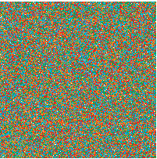

#canvasScramble
##Use canvas to completely scramble an image

Turn an image like this:


Into this:



##Simple usage
```javascript

$("img").click(function(){
  $(this).canvasScramble({debug:false,displayInput:false});
})
```

##Slightly more advanced usage
```javascript

$("img").click(function(){
  $(this).canvasScramble({
    debug:true,
    displayInput:true
  });
})
```

##Config options
```javascript
{
  debug:true, //output information to the console, performance metrics etc
  displayInput:true //preserve the original image in the DOM
}
```
